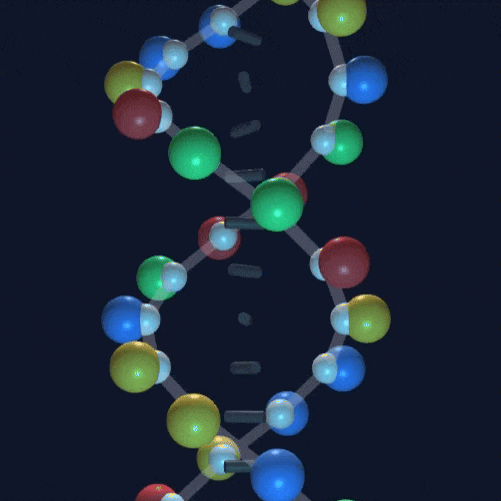

# 🧬 DNA 双螺旋结构可视化 (DNA Helix Visualizer)

[](https://github.com/)
[](https://threejs.org/)
[](LICENSE)

> 一个基于 Web 的交互式 3D DNA 双螺旋结构生成器。输入任意 DNA 序列，实时渲染对应的 3D 分子模型。

 
<!-- 提示：请截取一段你操作网页的 GIF 动图放在这里，这非常重要！ -->

## 🚀 在线演示

无需安装，直接在浏览器中运行：
👉 **[点击这里访问在线演示](https://jlchen5.github.io/DNAhelix/)**

## ✨ 主要功能

- **实时渲染**：输入 DNA 序列（A, T, C, G），即时生成 3D 模型。
- **交互体验**：支持鼠标拖拽旋转、缩放，全方位观察双螺旋结构。
- **碱基配对**：自动遵循查加夫规则（A-T, C-G）生成互补链。
- **颜色编码**：不同碱基使用不同颜色区分，直观易读。
- **轻量级**：单文件 HTML，无构建步骤，基于 Three.js。

## 🛠️ 技术栈

- **Three.js**: 用于 3D 渲染和场景管理。
- **HTML5/CSS3**: 现代化的 UI 设计和布局。
- **Vanilla JavaScript**: 原生 JS 实现逻辑，无框架依赖。

## 💻 本地运行

如果你想本地修改或运行：

1. 克隆仓库：
   ```bash
   git clone https://github.com/你的用户名/你的仓库名.git
